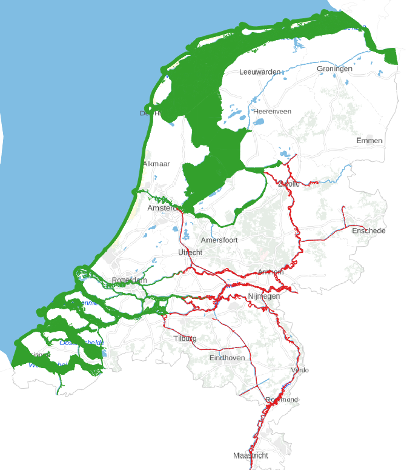
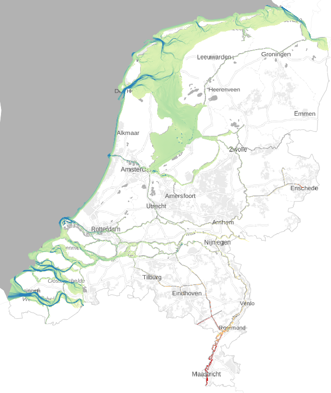

All files are in `notebooks/rijkswaterstaat` and numbered by order of to be executed.

## 1_bathymertrie
In this script we merge data from Baseline (version j23_6-v1, non-public) with grids from [bathymetrie-Nederland](https://maps.rijkswaterstaat.nl/geoweb55/index.html?viewer=Bathymetrie_Nederland) to one 5x5m GeoTiff.

We combine both sources as the Midden Limburgse en Noord Brabantse (MLNB) kanalen are not in Baseline and the Ijsselmeer is not completely covered in bathymetrie-Nederland. For the mask we use Top10NL waterdelen and manually filled a bollean column `baseline`

  
  

